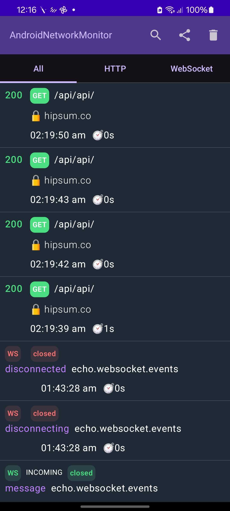
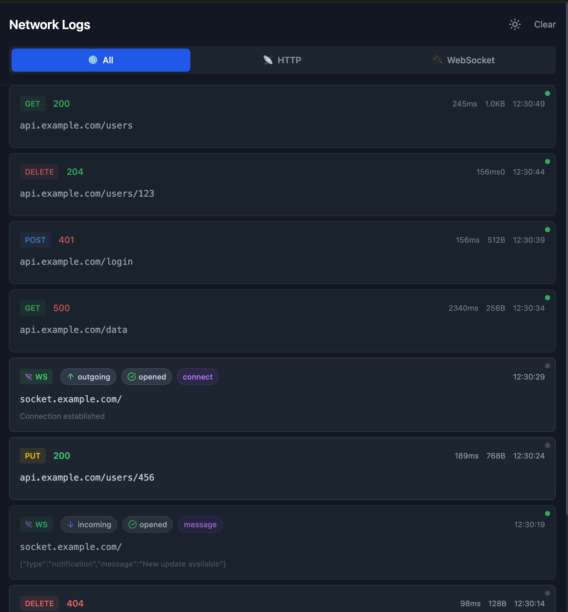
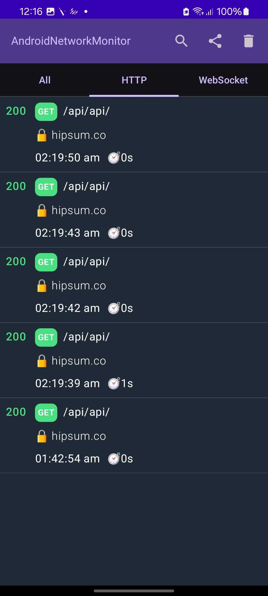
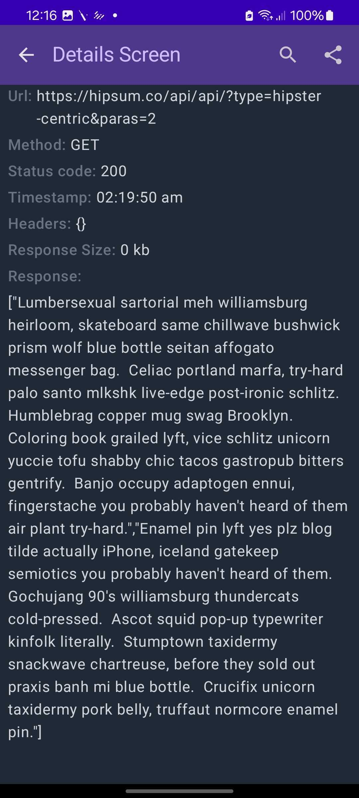
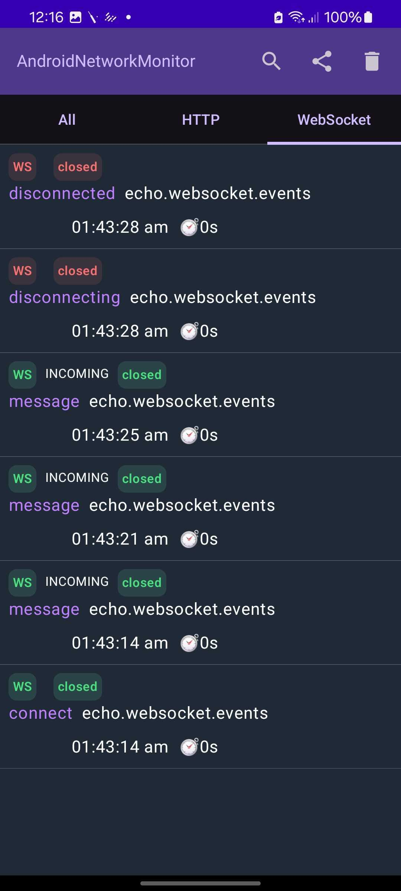
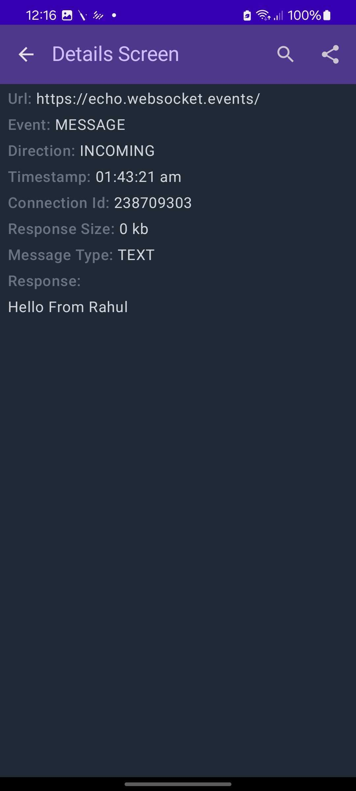

# Snorkl 🐙

[//]: # ([![GitHub release]&#40;https://img.shields.io/github/release/rahul-lohra/Snorkl.svg&#41;]&#40;https://github.com/rahul-lohra/Snorkl/releases&#41;)
[](https://github.com/rahul-lohra/Snorkl/packages)
[](LICENSE.txt)

**Snorkl** is a powerful Android network monitoring library that provides real-time insights into your app's HTTP and WebSocket network activity. Monitor your network traffic through both native Android UI and a convenient web-based dashboard accessible from any device on your local network.

## ✨ Features

- 🔍 **Real-time Network Monitoring** - Track HTTP requests and WebSocket connections as they happen
- 📱 **Native Android UI** - Built-in activity for monitoring directly on your device
- 🌐 **Web Dashboard** - Access network logs from any browser on your local network
- 🚀 **Easy Integration** - Simple interceptor setup with OkHttp
- 📊 **Detailed Logging** - Complete request/response data including headers, timing, and payload
- 🔌 **WebSocket Support** - Monitor WebSocket connections and messages
- 🎯 **Zero Configuration** - Works out of the box with minimal setup

## 🚀 Quick Start

### Installation

1. Add the repository to your `settings.gradle.kts`:

```kotlin
dependencyResolutionManagement {
    repositories {
        maven {
            url = uri("https://maven.pkg.github.com/rahul-lohra/Snorkl")
        }
    }
}
```

2. Add the dependency to your app's `build.gradle.kts`:

```kotlin
implementation("rahul.lohra.snorkl:snorkl:0.0.7-kotlin1.9")
```

### Basic Setup

#### Initialize the Web Server

Add this to your `Application` class:

```kotlin
class MyApplication : Application() {
    override fun onCreate() {
        super.onCreate()
        val availablePort = findAvailablePort()
        WebSocketServerManager.startServer(this, availablePort)
    }
}
```

#### Monitor HTTP Requests

Add the Snorkl interceptor to your OkHttp client:

```kotlin
val client = OkHttpClient.Builder()
    .addInterceptor(rahul.lohra.snorkl.network.NetworkLoggerInterceptor())
    .build()
```

#### Monitor WebSocket Connections

Attach the Snorkl listener to your WebSocket:

```kotlin
val request = Request.Builder().url(WEBSOCKET_URL).build()
val listener = rahul.lohra.snorkl.network.NetworkWebSocketListener()
webSocket = client.newWebSocket(request, listener)
```

## 📱 Usage

### Android UI

Launch the built-in network monitor activity:

```kotlin
// The activity is automatically available at:
// <your.package.name>.presentation.ui.NetworkMonitorActivity
```

### Web Dashboard

Once your app is running, Snorkl creates a local web server. Check your logcat for the connection details:

```
Inspector D  port: 44241, Phone IP: 192.168.1.6
```

Open your browser and navigate to `http://192.168.1.6:44241` to access the web dashboard. **⚠️Please use the IP address that is on your log cat** 

### Available Endpoints

| Endpoint            | Description                         |
|---------------------|-------------------------------------|
| `/`                 | Main dashboard                      |
| `/inspector1`       | Network monitoring interface        |
| `/assets/{path...}` | Static assets for the web interface |

---

## 📸 Snorkl Preview

### 📱 Mobile & 🌐 Web Interfaces

| Platform       |                                    Interface                                    | Description                                  |
|:---------------|:-------------------------------------------------------------------------------:|:---------------------------------------------|
| **📱 Android** |  | Native monitoring directly on your device    |
| **🌐 Web**     |         | Browser-based dashboard for desktop analysis |


### 🔍 Protocol Support

| Protocol         |                                Mobile View                                 |                                    Detail View                                    |
|:-----------------|:--------------------------------------------------------------------------:|:---------------------------------------------------------------------------------:|
| **🌐 HTTP**      |     |     |
| **🔗 WebSocket** |  |  |

## 🛠️ Development

### Building the Web Interface

The web dashboard is built using modern web technologies and needs to be compiled before use:

```bash
# Install dependencies
npm install

# Development server
npm run dev

# Build for production
npm run build
```

After building, copy the contents of the `dist/` folder to `/Project/snorkl/src/assets/web2/assets/` in the Android project.

### Release Process

To release a new version:

1. Update the `VERSION_NAME` in `gradle.properties`:
```properties
VERSION_NAME=0.0.7-kotlin1.9
```

2. Create and push a new tag
3. Publish to GitHub Packages

## 🤝 Contributing

Contributions are welcome! Please feel free to submit a Pull Request. For major changes, please open an issue first to discuss what you would like to change.

## 📄 License

This project is licensed under the Apache 2.0 License - see the [LICENSE](LICENSE.txt) file for details.

## 🐛 Issues & Support

If you encounter any issues or have questions, please [open an issue](https://github.com/rahul-lohra/Snorkl/issues) on GitHub.

Made with ❤️ by [Rahul Lohra](https://github.com/rahul-lohra)